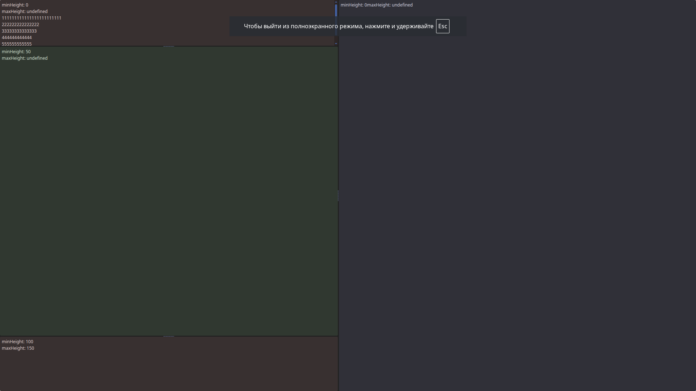
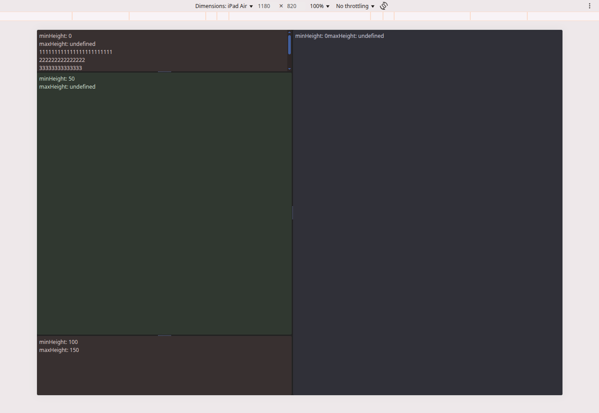

# ohae-ui-svelte
UI for game editors on PC

#### about

A UI component library for building game graphic editors, mimicking the look and feel of Blender's interface. Is a refactoring of the library [ohae-ui-webcomponents](https://github.com/lastuniverse/ohae-ui-webcomponents) being rewritten from Web Components to Svelte components. It includes:

- A set of UI components:
    - **Layout** component – a container for arranging the workspace layout
    - **Resizer** component – a resizer that adjusts the sizes of sibling Layout components
    - All components are reactive.

- a general interface initialization module based on JSON layout data  
- interface layout definition for the editor

#### online demo

[https://game.ragame.ru/ohae-ui/](https://game.ragame.ru/ohae-ui/)

#### screenshots

